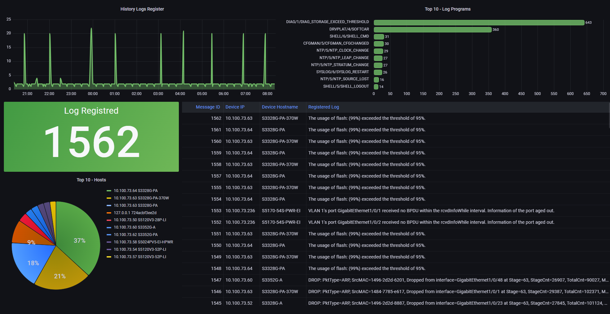

# SYSLOG-NG Appliance for MySQL Data Storage  



### This repository implements SYSLOG-NG package for receive logs and write in a MySQL database, also display the syslog data in Grafana Dashboard.

Prerequisites
Before you begin, ensure you have the following packages installed on your system:

- Git version 2.34.1
- Docker version 24.0.6, build ed223bc
- Docker Compose version v2.21.0

---
### Getting Started:

First, copy the line below and paste on your prompt to clone the repository:

```
git clone https://github.com/arthurcadore/syslog-appliance
```
If you don't have installed the package Git yet, do it before try to clone the respository!

Navigate to the project directory:

```
cd ./syslog-appliance
```

If you don't have Docker (and Docker-compose) installed on your system yet, it can be installed by run the following commands (Script for Ubuntu 22.04): 

```
./installDocker.sh
```

### Start Application's Container: 
Run the command below to start docker-compose file: 

```
docker compose up & 
```
The "&" character creates a process id for the command inputed in, with means that the container will not stop when you close the terminal. 

---

### Access Application:

Once the container is up and running, you can access the container by `syslog://127.0.0.1:514`. 

--- 
### Stop Container: 
To stop the running container, use the following command:

```
docker-compose down
```

This command stops and removes the containers, networks, defined in the docker-compose.yml file.

